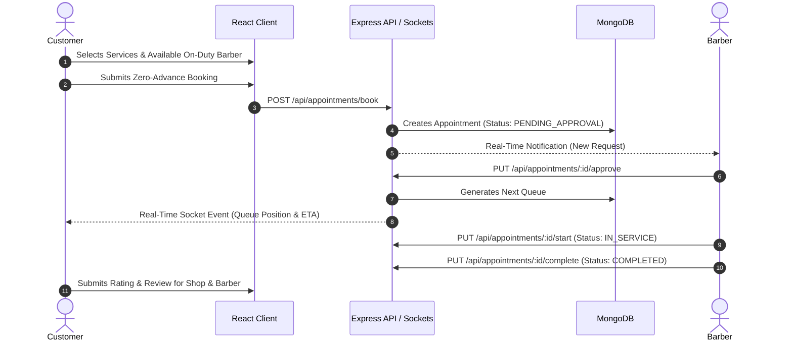
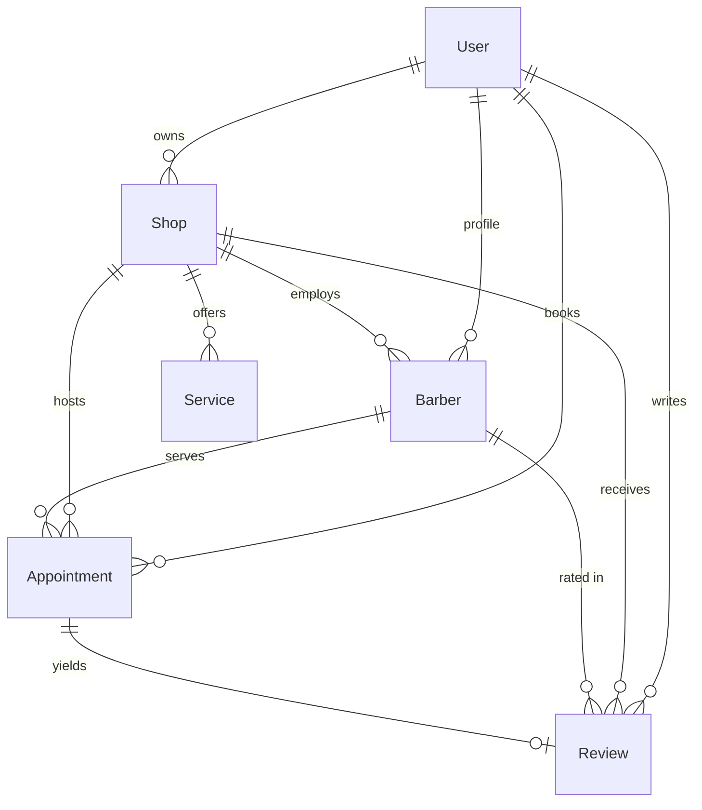

# 💈 BarbaeQ — Real-Time Salon & Barber Queue SaaS Platform

[](https://reactjs.org/)
[](https://vitejs.dev/)
[](https://nodejs.org/)
[](https://expressjs.com/)
[](https://www.mongodb.com/)
[](https://socket.io/)
[](https://tailwindcss.com/)
[](https://redux-toolkit.js.org/)

> **Your Queue, Simplified.** A modern multi-tenant, real-time barber & salon appointment SaaS platform with live queue tracking, chair assignment, delay buffers, walk-in management, and multi-role operations.

---

## 📌 Table of Contents
- [✨ Key Features by Role](#-key-features-by-role)
- [🛠️ Tech Stack](#️-tech-stack)
- [🏗️ System Architecture & Workflow](#️-system-architecture--workflow)
- [📊 Database Models & Relationships](#-database-models--relationships)
- [⚡ Real-Time Queue & ETA Algorithm](#-real-time-queue--eta-algorithm)
- [🚀 Quick Start & Installation](#-quick-start--installation)
- [⚙️ Environment Variables](#️-environment-variables)
- [📡 API Endpoint Reference](#-api-endpoint-reference)
- [📄 License](#-license)

---

## ✨ Key Features by Role

### 👤 1. Customer Experience
- **Salon Discovery**: Search approved salons, explore photo galleries, operational hours, verified ratings, and service menus.
- **3-Step Guided Booking**:
  1. *Select Services*: Multi-select services with transparent duration and price breakdown.
  2. *Choose Barber Chair*: Real-time barber selection showing availability (On-Duty vs. Off-Duty with disabled guards).
  3. *Review & Token Reserve*: Zero-advance booking confirmation.
- **Live Queue Tracking**: Real-time queue position counter, estimated wait time (ETA), and live stage stepper (Pending $\to$ In Line $\to$ In Service $\to$ Completed).
- **Post-Visit Reviews**: Rate both salon ambience and barber craft with star ratings and detailed feedback.

### ✂️ 2. Barber Station Dashboard
- **Station Chair Controls**: One-click toggle between **Active / On Duty** and **On Break**.
- **Booking Request Approvals**: Accept or reject incoming online customer booking requests with automatic sequential queue generation.
- **Walk-in Handling**: Built-in modal to instantly register walk-in customers into the queue.
- **Queue Delays Buffer**: Add live $+5\text{m}$, $+10\text{m}$, or $+15\text{m}$ buffer delays when haircuts run longer, automatically synchronizing ETAs for all waiting customers.
- **Execution Lifecycle**: One-click actions to *Start Service*, *Complete Service*, *Mark No-Show*, or *Cancel*.

### 🏬 3. Salon Owner Operations & Business Intelligence
- **Salon Setup & Verification**: Register salon details, location, phone, operational hours, and storefront photos for platform approval.
- **Staff & Catalog Management**: Add and manage barbers, assign service catalogs, and configure custom pricing.
- **Visual Analytics Suite (Recharts)**:
  - **KPI Metric Cards**: Real-time counts for Today's Revenue, Today's Bookings, Completed, Cancelled, and No-Shows.
  - **7-Day Revenue Trend (Area Chart)**: Daily revenue tracking from completed visits.
  - **Customer Volume (Stacked Bar Chart)**: Volume breakdown of completed vs. other bookings.
  - **Outcome Breakdown (Donut Chart)**: Visual share of Completed, Cancelled, and No-Show appointments.
- **Live Shop Operations Switch**: One-click toggle to open or close the salon.

### 🛡️ 4. Super Admin Moderation
- **Shop Approval Queue**: Review newly registered salon submissions with photo verification and one-click Approval/Rejection.
- **Platform Moderation**: Enable or deactivate non-compliant shops and oversee platform-wide statistics.

---

## 🛠️ Tech Stack

### **Frontend**
- **Core**: React 18 (Vite SPA)
- **State Management**: Redux Toolkit (`@reduxjs/toolkit` + `react-redux`)
- **Routing**: React Router DOM v6 with role-based layout and authentication guards
- **Styling**: Tailwind CSS 3 with custom neutral/amber/emerald design system
- **Charts & Visualizations**: Recharts
- **Icons**: Lucide React + React Icons
- **Notifications**: React Hot Toast
- **Form Validation**: Zod + native input sanitization

### **Backend**
- **Runtime**: Node.js (ES Modules)
- **Framework**: Express.js
- **Database**: MongoDB Atlas via Mongoose 8
- **Authentication**: JWT (JSON Web Tokens) with HTTP-only cookies & Bcrypt.js
- **Real-Time Engine**: Socket.io
- **Media & File Storage**: Cloudinary with Multer Storage Cloudinary
- **Request Validation**: Zod validation middleware

---

## 🏗️ System Architecture & Workflow

### End-to-End Booking & Queue Lifecycle



---

## 📊 Database Models & Relationships



---

## ⚡ Real-Time Queue & ETA Algorithm

Each barber station calculates estimated wait times dynamically in real-time:

$$\text{Estimated Wait (ETA)} = \text{Remaining Time of In-Service Cut} + \sum_{i=1}^{N} \text{Duration}(\text{Appointment}_i) + \text{Barber Delay Minutes}$$

- **`Appointment_i`**: All active appointments waiting ahead in line for that specific barber.
- **`Barber Delay Minutes`**: Real-time buffer added by the barber if current service takes longer.

---

## 🚀 Quick Start & Installation

### 1. Prerequisites
- **Node.js**: `v18.0.0` or higher
- **npm** or **yarn**
- **MongoDB Atlas** database URI or local MongoDB instance
- **Cloudinary** account for image uploads

---

### 2. Clone Repository
```bash
git clone https://github.com/your-username/BarbaeQ.git
cd BarbaeQ
```

---

### 3. Server Setup
```bash
cd server
npm install
```

Create a `.env` file in the `server` directory (see [Environment Variables](#️-environment-variables)).

Start backend development server:
```bash
npm run dev
```
Backend runs at `http://localhost:5000`.

---

### 4. Client Setup
```bash
cd ../client
npm install
npm run dev
```
Client runs at `http://localhost:5173`.

---

## ⚙️ Environment Variables

### Server Configuration (`server/.env`)
```env
PORT=5000
NODE_ENV=development
MONGO_URI=mongodb+srv://<username>:<password>@cluster.mongodb.net/barbaeq?retryWrites=true&w=majority
JWT_SECRET=your_jwt_super_secret_key_here
JWT_EXPIRE=7d
CLIENT_URL=http://localhost:5173

# Cloudinary Configuration
CLOUDINARY_CLOUD_NAME=your_cloudinary_cloud_name
CLOUDINARY_API_KEY=your_cloudinary_api_key
CLOUDINARY_API_SECRET=your_cloudinary_api_secret
```

---

## 📡 API Endpoint Reference

### 🔐 Authentication (`/api/auth`)
| Method | Endpoint | Description | Access |
| :--- | :--- | :--- | :--- |
| `POST` | `/api/auth/register` | Register new user account | Public |
| `POST` | `/api/auth/login` | Login user & issue HTTP-only JWT | Public |
| `POST` | `/api/auth/logout` | Logout user & clear cookie | Authenticated |
| `GET` | `/api/auth/me` | Get current logged-in user profile | Authenticated |
| `PUT` | `/api/auth/switch-role` | Switch active role context | Authenticated |

### 🏬 Shops (`/api/shops`)
| Method | Endpoint | Description | Access |
| :--- | :--- | :--- | :--- |
| `GET` | `/api/shops` | List approved salons with search & filters | Public |
| `GET` | `/api/shops/:id` | Get salon details, services & barbers | Public |
| `POST` | `/api/shops` | Register a new salon | Shop Owner |
| `PUT` | `/api/shops/:id` | Update salon details or Open/Closed toggle | Shop Owner |
| `GET` | `/api/shops/my/shop` | Get current owner's salon profile | Shop Owner |

### ✂️ Barbers & Stations (`/api/barbers`)
| Method | Endpoint | Description | Access |
| :--- | :--- | :--- | :--- |
| `GET` | `/api/barbers/shop/:shopId` | Get all barbers in a shop | Public |
| `GET` | `/api/barbers/me` | Get current barber station profile | Barber |
| `PUT` | `/api/barbers/availability` | Toggle On-Duty / On-Break status | Barber |
| `PUT` | `/api/barbers/delay` | Adjust live queue buffer delay (mins) | Barber |

### 📅 Appointments & Queue (`/api/appointments`)
| Method | Endpoint | Description | Access |
| :--- | :--- | :--- | :--- |
| `POST` | `/api/appointments/book` | Book an appointment with on-duty barber | Customer |
| `POST` | `/api/appointments/walk-in` | Add an in-store walk-in to queue | Barber |
| `GET` | `/api/appointments/my` | Get current customer's appointments | Customer |
| `GET` | `/api/appointments/barber/queue`| Get live queue line for barber station | Barber |
| `PUT` | `/api/appointments/:id/approve` | Approve customer booking into queue | Barber / Owner |
| `PUT` | `/api/appointments/:id/start` | Start in-chair haircut service | Barber |
| `PUT` | `/api/appointments/:id/complete`| Complete service and record revenue | Barber |
| `PUT` | `/api/appointments/:id/cancel` | Cancel booking | Customer / Barber / Owner |
| `PUT` | `/api/appointments/:id/no-show` | Mark customer as no-show | Barber |

### ⭐ Reviews (`/api/reviews`)
| Method | Endpoint | Description | Access |
| :--- | :--- | :--- | :--- |
| `POST` | `/api/reviews` | Submit/update review for shop & barber | Customer (Completed only) |
| `GET` | `/api/reviews/shop/:shopId` | Get reviews for a salon | Public |
| `GET` | `/api/reviews/barber/me` | Get reviews for current barber profile | Barber |

### 🛡️ Admin Moderation (`/api/admin`)
| Method | Endpoint | Description | Access |
| :--- | :--- | :--- | :--- |
| `GET` | `/api/admin/dashboard` | Overall platform stats & metrics | Admin |
| `GET` | `/api/admin/shops` | List pending, approved, or rejected shops | Admin |
| `PUT` | `/api/admin/shops/:id/status` | Approve or Reject shop application | Admin |
| `PUT` | `/api/admin/shops/:id/toggle-active` | Deactivate / Activate shop | Admin |

---

## 📄 License
This project is open source and available under the [MIT License](LICENSE).
